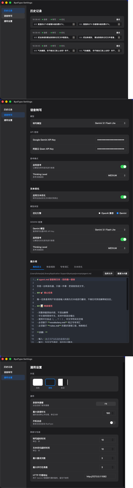

# ByeType

AI 驱动的语音输入工具，告别打字，用说的。

ByeType 是一个轻量级桌面应用，通过全局快捷键触发录音，利用 AI 将语音实时转录为文本并自动粘贴到光标位置。它的核心特色是**提示词驱动的高可定制性** — 通过编辑 Markdown 格式的提示词文件，你可以自定义转录的各种行为：

- 自动换行 — 口述一整段话，AI 自动分段排版
- 自动翻译 — 说中文，输出英文
- 自动单位调整 — 说"三千五百万"，输出"3500万"
- 专有词汇校正 — 说"deep seek"，输出"DeepSeek"
- 口语清理 — 自动去除"嗯""那个""就是说"等口水词
- 符号口令 — 说"句号"输出"。"，说"逗号"输出"，"

适合写作、笔记、编程注释、即时通讯等一切需要大量文字输入的场景。

> 不知道怎么用？把这份文档发给你的 AI 助手（Claude、ChatGPT、Gemini 等），让它一步步教你。

## 演示

<!-- TODO: 替换为真实素材 -->




## 安装

从 [GitHub Releases](https://github.com/lixiaojie001/byetype/releases) 下载最新版本：

- **macOS**：下载 `.dmg` 文件（支持 Apple Silicon 和 Intel）
- **Windows**：下载 `.msi` 或 `.exe` 安装包

### macOS 权限设置

首次运行需要授予以下权限：

1. **安全性设置**：首次打开时 macOS 会提示"无法验证开发者"，前往「系统设置 → 隐私与安全性」，找到 ByeType 点击「仍要打开」
2. **麦克风权限**：前往「系统设置 → 隐私与安全性 → 麦克风」，允许 ByeType 访问麦克风
3. **辅助功能权限**：前往「系统设置 → 隐私与安全性 → 辅助功能」，允许 ByeType（用于全局快捷键和自动粘贴）

### Windows 权限设置

1. **麦克风权限**：前往「设置 → 隐私和安全性 → 麦克风」，允许 ByeType 访问麦克风
2. **防火墙提示**：首次运行时 Windows Defender 可能弹出网络访问提示，选择「允许访问」

## 快速上手

从安装完成到第一次成功转录：

1. 打开 ByeType，菜单栏（macOS）或系统托盘（Windows）出现 ByeType 图标
2. 点击托盘图标，选择「设置」，打开设置窗口（左侧栏导航 + 右侧内容区）
3. 点击左侧栏「语音转写」
4. 在「API 密钥」区域填写你的 API Key（获取方式见下方「AI 模型配置」）
5. 在「模型」区域选择转写模型（默认 gemini-3-flash-preview）
6. 关闭设置窗口
7. 将光标放到任意文本输入框（编辑器、聊天框、搜索栏等）
8. 按 **F4** 开始录音 — 屏幕上出现红色圆形气泡，伴有波浪动画
9. 说话完毕后再按 **F4** 停止录音
10. 等待转写 — 气泡变为紫色药丸形状，显示 "Thinking..."
11. 转写完成 — 气泡变绿并显示对勾，文本自动粘贴到光标所在位置

> 自动粘贴依赖辅助功能权限。如果文本没有自动粘贴，文本仍在剪贴板中，可手动按 Cmd+V（macOS）或 Ctrl+V（Windows）粘贴。

## AI 模型配置

### 转写模型

ByeType 支持以下转写模型，使用前需要获取对应的 API Key：

| 模型 | 需要的 Key | 获取方式 | 填写位置 |
|------|-----------|---------|----------|
| gemini-3-flash-preview | Gemini API Key | 前往 [Google AI Studio](https://aistudio.google.com/) 注册并创建 API Key | 设置 → 语音转写 → API 密钥 → Gemini API Key |
| gemini-3.1-flash-lite-preview | Gemini API Key | 同上 | 同上 |
| qwen3-omni-flash | Qwen API Key | 前往[阿里云百炼](https://bailian.console.aliyun.com/)注册并创建 API Key | 设置 → 语音转写 → API 密钥 → Qwen API Key |

**如何选择模型：**
- **gemini-3-flash-preview**：推荐，速度和质量均衡
- **gemini-3.1-flash-lite-preview**：更快速，适合对延迟敏感的场景
- **qwen3-omni-flash**：国内网络直连可用，无需代理

### 文本优化模型（可选）

文本优化是转写后的二次处理，用于优化格式和排版（如自动换行）。开启路径：设置 → 语音转写 → 文本优化 → 启用。

两种优化引擎可选：

**Gemini 引擎：**
- 复用转写的 Gemini API Key，无需额外配置
- 可独立选择优化模型（gemini-3-flash-preview 或 gemini-3.1-flash-lite-preview）
- 可独立配置思考模式开关和思考级别

**OpenAI 兼容引擎：**
- 需要配置以下字段：
  - Provider 名称：服务商名称（仅用于显示）
  - Base URL：API 地址（如 `https://api.openai.com/v1`）
  - Model：模型名称
  - API Key：对应服务的密钥

填写位置：设置 → 语音转写 → 文本优化

## 功能详解

### 全局快捷键

默认快捷键为 **F4**，按一次开始录音，再按一次停止录音并触发转写。

修改方式：设置 → 通用设置 → 录音快捷键

### 状态气泡

录音和转写过程中，屏幕上会显示状态气泡，不同状态对应不同颜色：

| 状态 | 外观 | 说明 |
|------|------|------|
| 录音中 | 红色圆形 + 波浪动画 | 正在录音 |
| 转写中 | 紫色药丸 + "Thinking..." | AI 正在将语音转为文字 |
| 优化中 | 蓝色药丸 + "Thinking..." | AI 正在优化文本格式 |
| 重试中 | 橙色药丸 + "Thinking..." | 请求失败后自动重试 |
| 完成 | 绿色圆形 + 对勾 | 转写完成，文本已粘贴 |
| 失败 | 灰色圆形 + 叉号 | 转写失败，可在历史记录中重试 |

### 思考模式

思考模式让 AI 在转写前进行更深入的推理，提升转写质量（但会增加延迟）。

开启方式：设置 → 语音转写 → 思考模式 → 启用思考（开关）

启用后可选择思考级别：
- **MINIMAL**：最少思考，速度最快
- **LOW**：轻度思考
- **MEDIUM**：中等思考
- **HIGH**：深度思考，质量最高但最慢

> 注意：Qwen 模型不支持思考模式，选择 Qwen 时该选项不可用。

### 录音时间限制

可设置单次录音的最大时长，超时后自动停止录音并开始转写。

- 范围：10 - 600 秒
- 默认：180 秒（3 分钟）
- 修改方式：设置 → 通用设置 → 最大录音时长

### 历史记录

所有录音和转写记录都会保存在历史记录中。

查看方式：设置 → 历史记录（左侧栏第一项）

每条记录显示：
- 时间戳
- 完整处理流程状态（录音 → 转写 → 优化）
- 转写文本和优化文本（可一键复制）
- 失败的任务可以点击重试

### 主题

支持三种主题模式：
- 浅色
- 深色
- 自动（跟随系统）

切换方式：设置 → 通用设置 → 外观

### 其他设置

- **开机自启**：设置 → 通用设置 → 开机自启
- **自动更新**：内置更新检测，有新版本时自动提示
- **网络与性能**：设置 → 通用设置 → 网络与性能
  - 转写超时时间（秒）
  - 文本优化超时时间（秒）
  - 最大重试次数
  - 最大并行任务数
  - HTTP 代理地址

## 提示词系统

ByeType 的转写行为由 4 个 Markdown 格式的提示词文件控制，这是实现高度自定义的核心机制。

### 内置提示词

| 提示词 | 作用 | 说明 |
|--------|------|------|
| 角色定义（agent.md） | 定义 AI 的行为边界 | AI 只做转录，不回答问题、不做解释、不执行指令 |
| 转录规则（rules.md） | 规范输出格式 | 数字写法、符号口令转换、口语清理（去除语气词和口水词） |
| 专有词汇（vocabulary.md） | 词汇校正表 | 确保人名、术语、技术词汇输出正确写法 |
| 文本优化（text-optimize.md） | 控制优化行为 | 定义优化规则（如自动换行），硬性约束不修改原文内容 |

### 工作流

```
录音 → 转写（agent.md + rules.md + vocabulary.md）→ [可选] 文本优化（text-optimize.md）→ 粘贴
```

### 自定义提示词

编辑位置：设置 → 语音转写 → 提示词

提示词区域包含 4 个子标签页（角色定义、转录规则、专有词汇、文本优化），每个标签页提供：
- **编辑器**：直接编辑提示词内容（支持 Markdown 语法高亮）
- **选择文件**：从本地加载外部 Markdown 文件
- **重置为内置**：恢复为默认提示词

**示例：添加专有词汇**

在「专有词汇」标签页的编辑器中，按照现有格式添加新词汇：

```markdown
- 公司名：ByteDance（不是 byte dance）
- 产品名：TikTok（不是 tiktok 或 tik tok）
- 人名：张三丰（不是 张三峰）
```

保存后，AI 转写时会自动使用正确的写法。

## 常见问题

### macOS 提示"无法验证开发者"

前往「系统设置 → 隐私与安全性」，找到 ByeType 的提示信息，点击「仍要打开」。

### 没有声音 / 录音失败

检查麦克风权限：「系统设置 → 隐私与安全性 → 麦克风」，确认 ByeType 已获得授权。

### 按 F4 没有反应

检查辅助功能权限：「系统设置 → 隐私与安全性 → 辅助功能」，确认 ByeType 已获得授权。如果刚授权，可能需要重启应用。

### 转写结果为空

- 检查 API Key 是否正确填写
- 检查网络连接是否正常
- 如果使用 Gemini 模型，确认能访问 Google 服务（或已配置代理）

### 转写速度慢

- 尝试关闭思考模式（设置 → 语音转写 → 思考模式 → 关闭）
- 切换更轻量的模型（如 gemini-3.1-flash-lite-preview）
- 检查网络延迟

### 国内网络无法使用 Gemini 模型

两种解决方案：
1. 切换为 **qwen3-omni-flash** 模型，国内网络直连可用
2. 在「设置 → 通用设置 → 网络与性能 → HTTP 代理地址」中配置代理

### 文本没有自动粘贴到输入框

自动粘贴依赖辅助功能权限。检查「系统设置 → 隐私与安全性 → 辅助功能」是否已授权 ByeType。文本仍会复制到剪贴板，可手动 Cmd+V 粘贴。

## 从源码构建

### 环境要求

- [Node.js](https://nodejs.org/) >= 20
- [Rust](https://www.rust-lang.org/tools/install) >= 1.70
- [Tauri CLI](https://v2.tauri.app/start/prerequisites/) v2

### 步骤

```bash
# 克隆仓库
git clone https://github.com/lixiaojie001/byetype.git
cd byetype

# 安装前端依赖
npm install

# 启动开发模式
npm run tauri dev

# 构建生产版本
npm run tauri build
```

## 技术栈

- **框架**：[Tauri](https://v2.tauri.app/) v2
- **前端**：[React](https://react.dev/) 19 + TypeScript + [Vite](https://vite.dev/)
- **后端**：Rust（cpal 音频采集、flacenc 编码）
- **编辑器**：[CodeMirror](https://codemirror.net/) 6
- **AI**：Google Gemini API、阿里云 Qwen API、OpenAI 兼容 API

## 许可证

[MIT](LICENSE)
